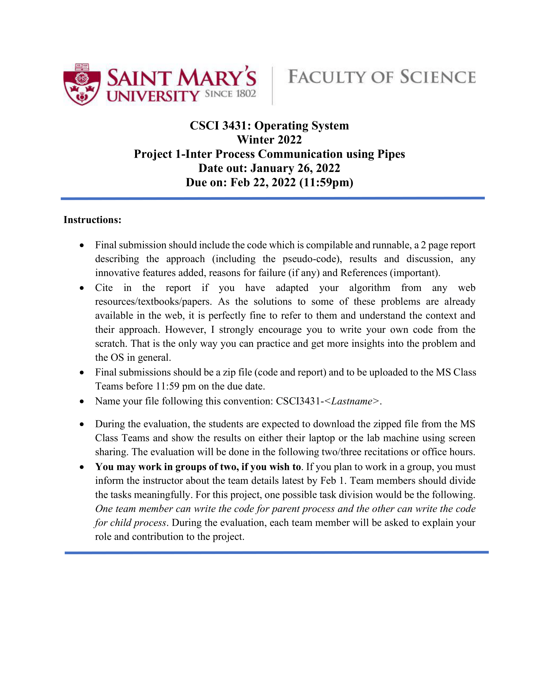
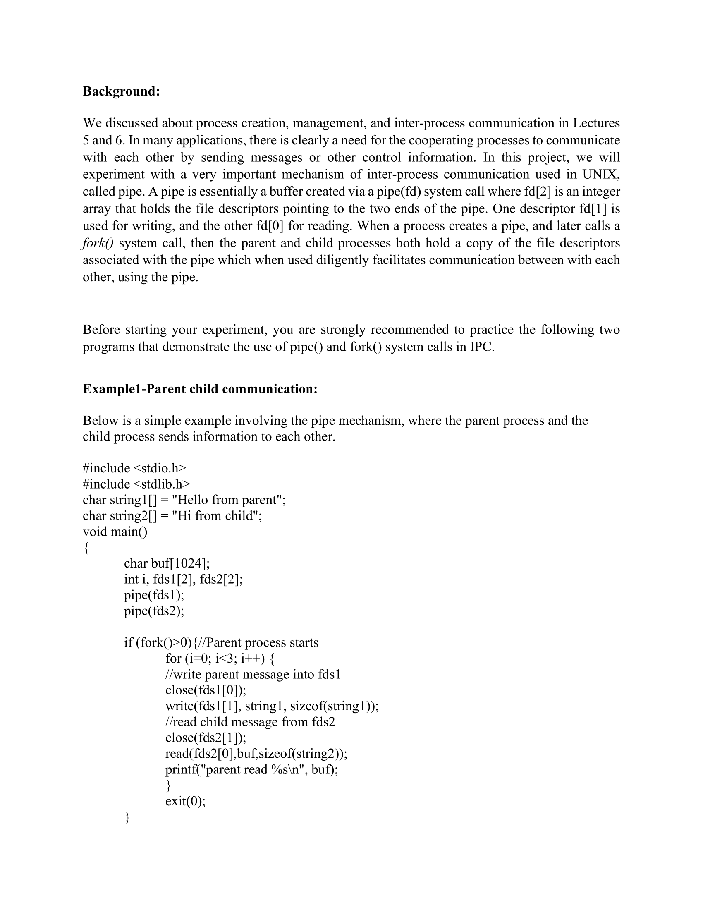
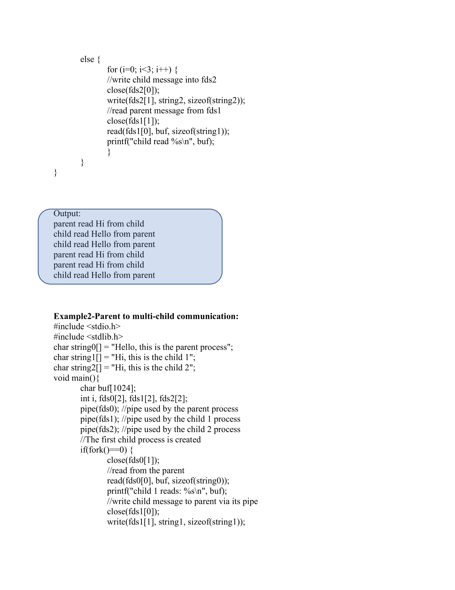
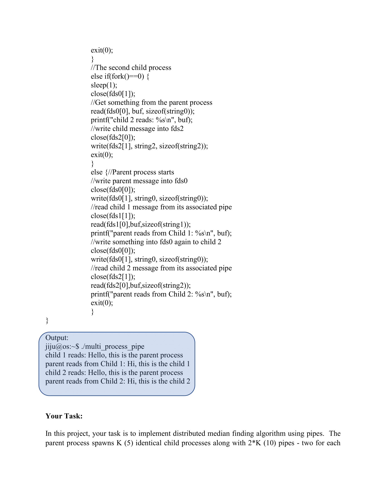
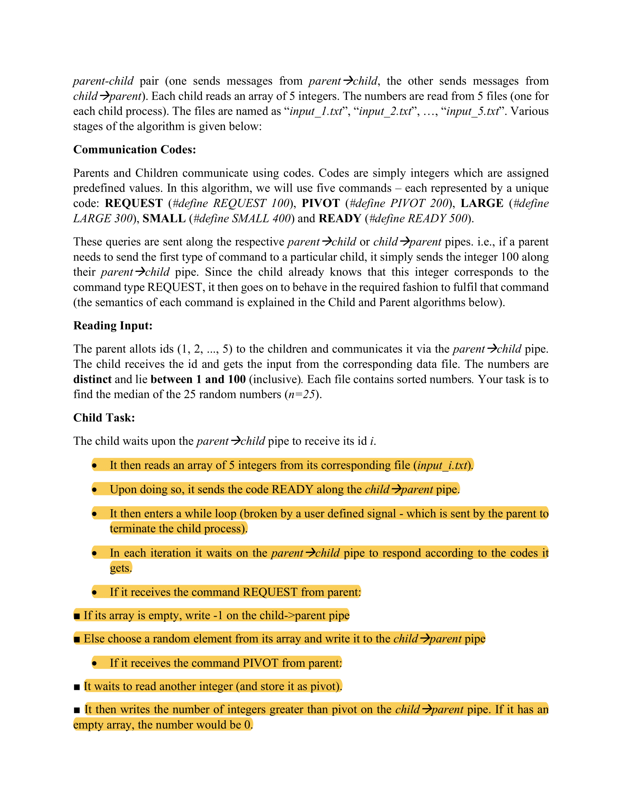
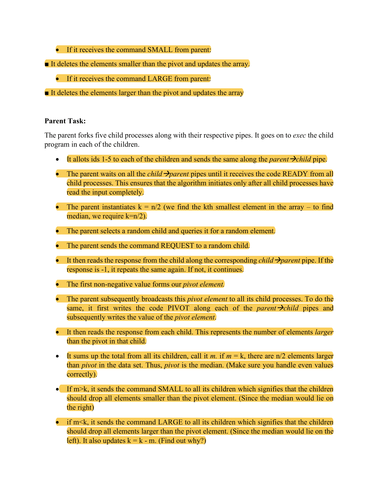
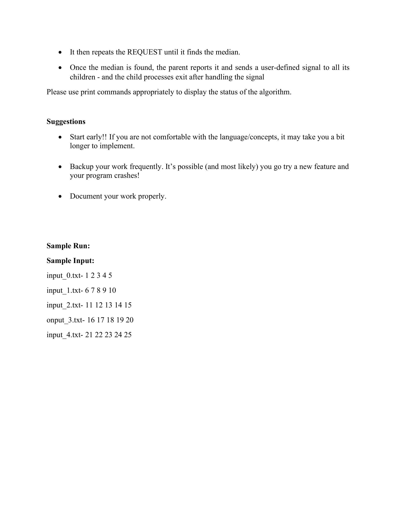
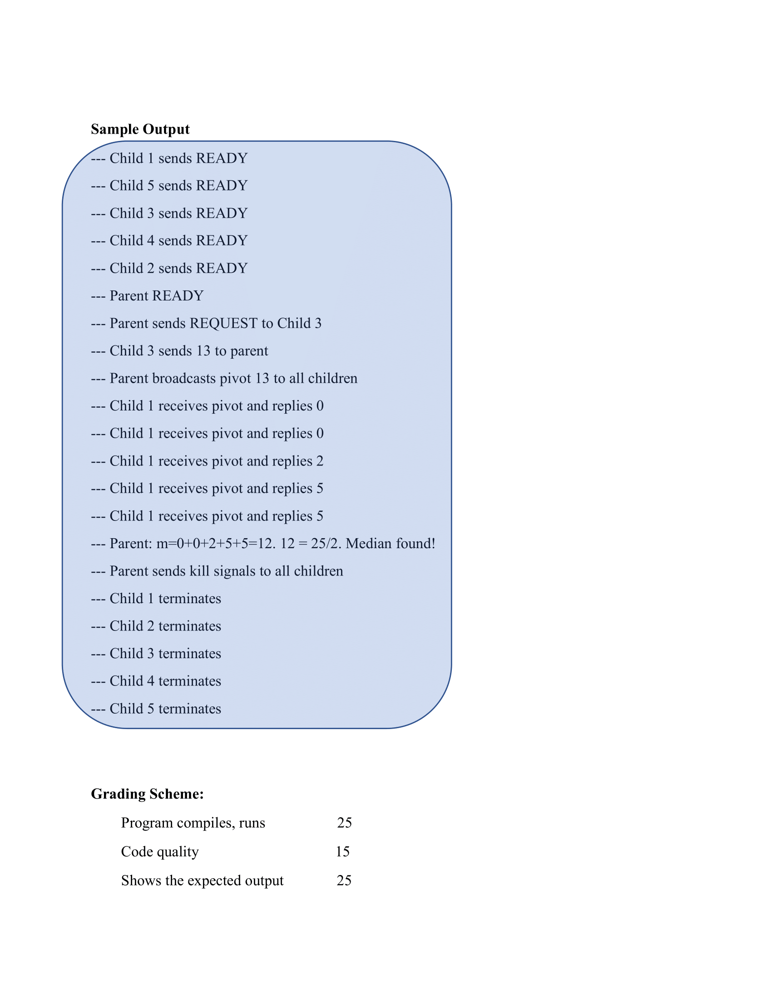
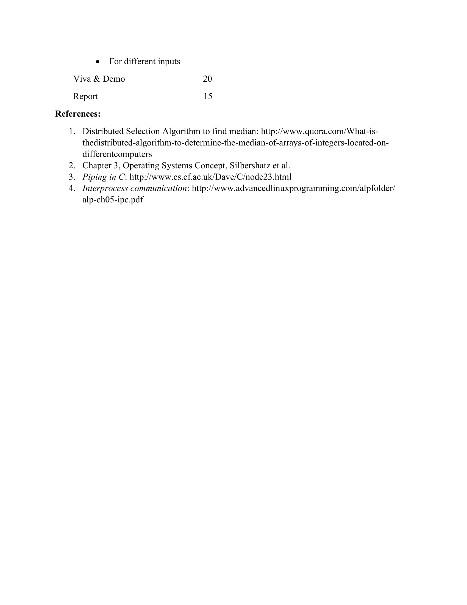

# Inter-Process-Communication-Distributed-Median-Finder
# Project for CSCI3431 Operating System Winter 2022
In this project, the task was to implement distributed median finding algorithm using pipes. 
The parent process spawns K(5) identical child processes using fork() system call along with 2*K (10) pipes using pipe() system call - two for each parent-child pair (one sends messages from parent to child, the other sends messages from child to parent). Each child reads an array of 5 integers. The numbers are read from 5 files (one for each child process). The files are named “input_1.txt”, “input_2.txt”, “input_3.txt”, “input_4.txt” and “input_5.txt”.
# Technologies used:
                - C
# Instruction to compile and run:
                - gcc medianIPC.c //to compile the program
                - ./a.out //to execute
                
# Project Instructions

#Project Report

